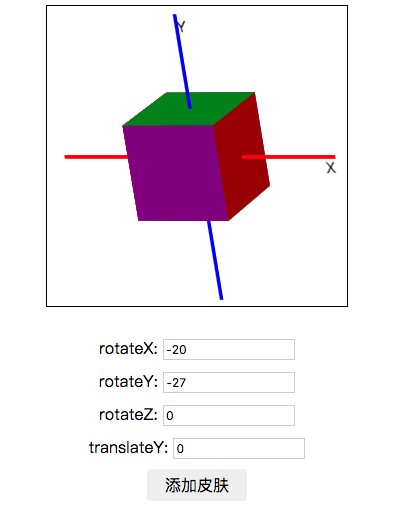

# vue-3d-box

## feature
* a css3 3d box for vue component
* coustom the rotate angle
* support the material

## usage

```js
// import as a component
import box from './components/box.vue'
// use it and transport the config
<box 
      :boxX="boxX"
      :boxY="boxY"
      :boxZ="boxZ"
      :rotateX="rotateX"
      :rotateY="rotateY"
      :rotateZ="rotateZ"
      :translateY="translateY"
      :imgX="imgX"
      :imgY="imgY"
      :imgZ="imgZ"
    />
```

## Project setup
```
yarn install
```

### Compiles and hot-reloads for development
```
yarn run serve
```